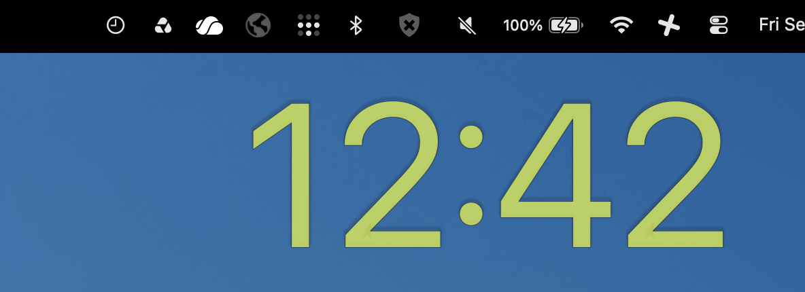

# BigClock



BigClock was inspired by another BigClock app written by Sandor Szatmari. That
app seemed to be abandoned and did not have an ARM version available that I
could find. So I had Copilot vibe code this as a replacement.

Note that I don't know Swift and have never made a macOS app, so this thing
might be a bit buggy. I want to keep it pretty basic, the set of features it
has now is probably the most I will ever put into it. I welcome bug fix PRs.

## Installing

The easiest way to install is via Homebrew:

```sh
brew trust --cask hashicorp/tap/hashicorp-vagrant
xattr -d com.apple.quarantine /Applications/BigClock.app
```

Note that if you don't remove the quarantine, the app won't run.  You can do
that with the above command, or by going into Settings and allowing the program
to run.

## Building From Source

Open `BigClock.xcodeproj` in Xcode and build the `BigClock` scheme.
